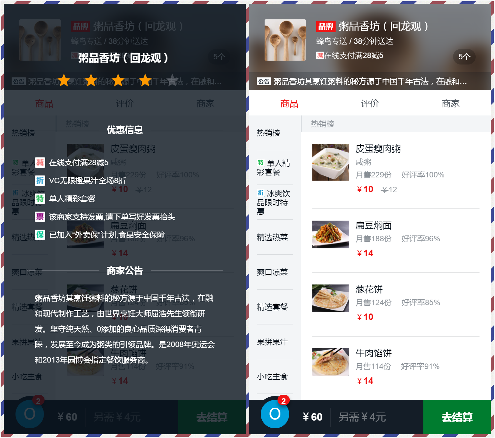
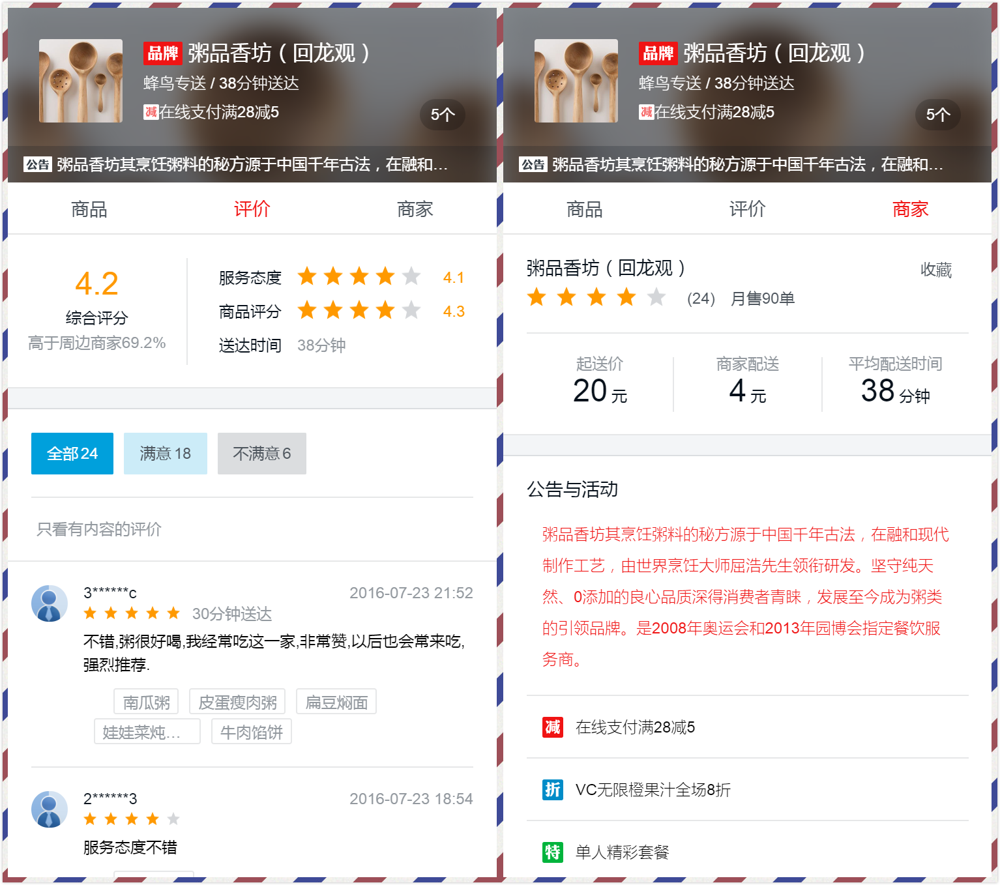

# sell-vue2.0

一个简单的vue项目，仿饿了么外卖APP。通过这个项目来学习使用 vue.js 全家桶。

## 运行截图




## 在线地址

[个人作品 - 仿饿了么外卖APP](http://maqingbo.top/elm)

> 移动端项目，请使用浏览器的F12开发者工具模拟器查看效果

## how to run

``` bash
# 安装依赖
npm install

# 端口改到了 8081
npm run dev
```

## 技术栈

-   使用 Vue-cli 脚手架初始化 Vue.js 项目
-   组件化、模块化的开发模式
-   模拟 json 后端数据，前后端分离开发
-   es6 + eslint
-   使用 scss 编写模块化的 CSS
-   使用 vue-router 解决路由问题
-   使用 vue-resource 与后端数据交互
-   使用第三方 JS 插件 better-scroll 进行交互
